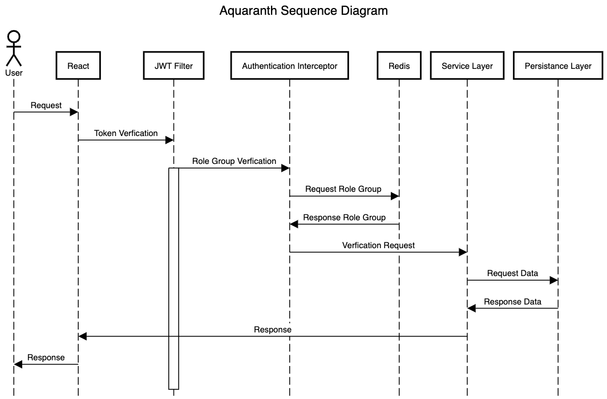

Sequence Diagram
--- 

> 해당 시퀀스 다이어그램은 사용자가 Aquaranth 서비스를 이용할 경우, 
> 
> 토큰 인증과, 데이터를 전달받는 과정을 시각화한 시퀀스 다이어그램 입니다.
> 


powered by [sequencediagram.org](https://sequencediagram.org/)

```
title Aquaranth Sequence Diagram

actor User
User->React:Request
React->JWT Filter: Token Verfication
JWT Filter->Authentication Interceptor:Role Group Verfication
activate JWT Filter
Authentication Interceptor->Redis:Request Role Group 
Redis->Authentication Interceptor:Response Role Group
Authentication Interceptor->Service Layer : Verfication Request
Service Layer -> Persistance Layer :Request Data
Persistance Layer ->Service Layer :Response Data
Service Layer ->React:Response
React->User:Response
```
